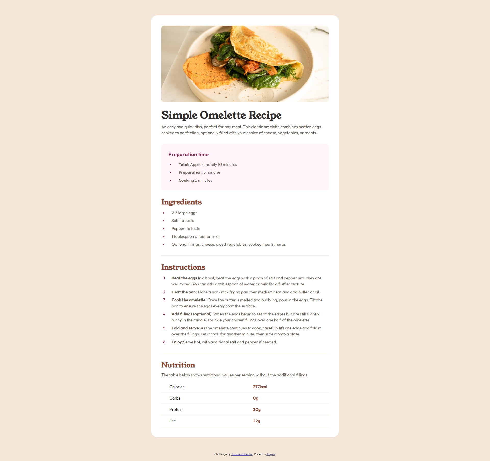

# Frontend Mentor - Recipe page solution

This is a solution to the [Recipe page challenge on Frontend Mentor](https://www.frontendmentor.io/challenges/recipe-page-KiTsR8QQKm). Frontend Mentor challenges help you improve your coding skills by building realistic projects. 

## Table of contents

- [Overview](#overview)
  - [The challenge](#the-challenge)
  - [Screenshot](#screenshot)
  - [Links](#links)
- [My process](#my-process)
  - [Built with](#built-with)
  - [What I learned](#what-i-learned)
  - [Continued development](#continued-development)
- [Author](#author)

**Note: Delete this note and update the table of contents based on what sections you keep.**

## Overview

### Screenshot

### Links

- Solution URL: [Add solution URL here](https://github.com/psdesignro/recipies-page)
- Live Site URL: [Add live site URL here](https://psdesignro.github.io/recipies-page/)

## My process

### Built with

- Semantic HTML5 markup
- CSS custom properties
- Flexbox
- CSS Grid

### What I learned

I didn't use CSS grid for a while, but I decided to use it over table, because as far as I know, table is a mess on small devices

I also unse one intermediate media query, that would work  for tablets.

### Continued development

I got the Frontend Mentor Pro  subscription and hope to dive more into interesting challenges

## Author

- Website - [Eugen](https://github.com/psdesignro)
- Frontend Mentor - [@psdesignro](https://www.frontendmentor.io/profile/psdesignro)

